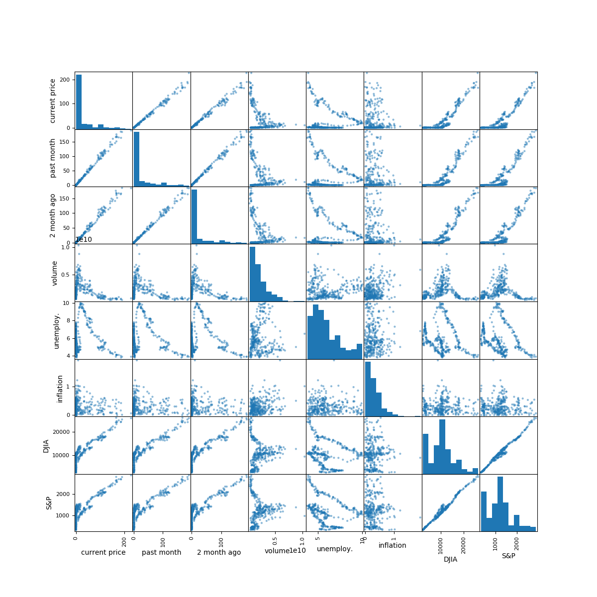

The previous plot show the correlations between differents features and the features and the target.
The stock we used is apple stock. We picked this stock randomly from all the stocks we are
experimenting with. 

The target is current stock price. On the other hand, the features are: stock price last month(past
month), stock price two months ago(2 month ago), company volume, unemployment rate, inflation rate,
level of Dow Jones Industrial Averages and level of S & P 500.

Two things particularly interesting about the plot:

1. It shows the correlation between the targest with each feature individually in the first row.
From the plot, we can clearly see that the most relavent features are stock price last month, stock
price two months ago, level of Dow Jones Industrial Averages and level of S & P 500. 
Unemployment rate and volume have slightly negative influence while inlfation rate has medium
positive influence on current stock price.

2. It displays the correlation between features. We are able to detect that level of Dow Jones Industrial Averages 
level of S & P 500, stock price last month and stock price two month ago have strong relations with
each other. This provides justification for performing PCA and other nonlinear dimension reduction
techniques.

